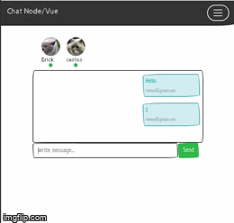
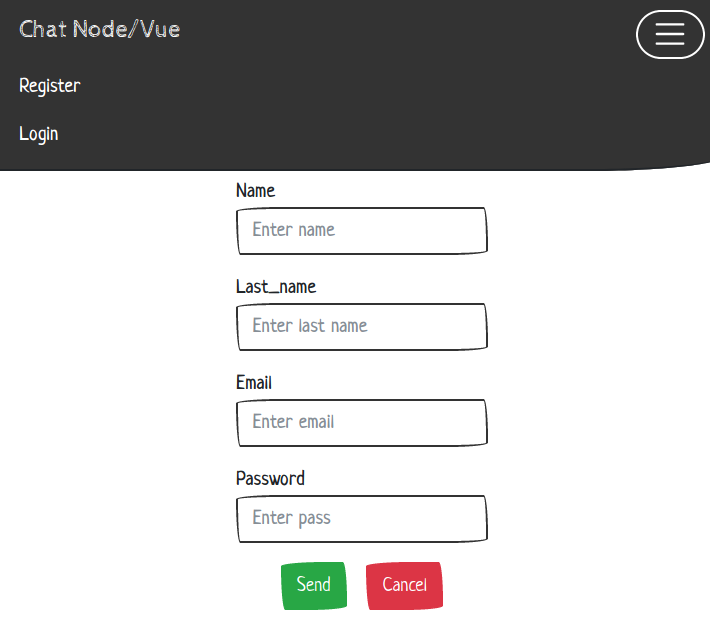
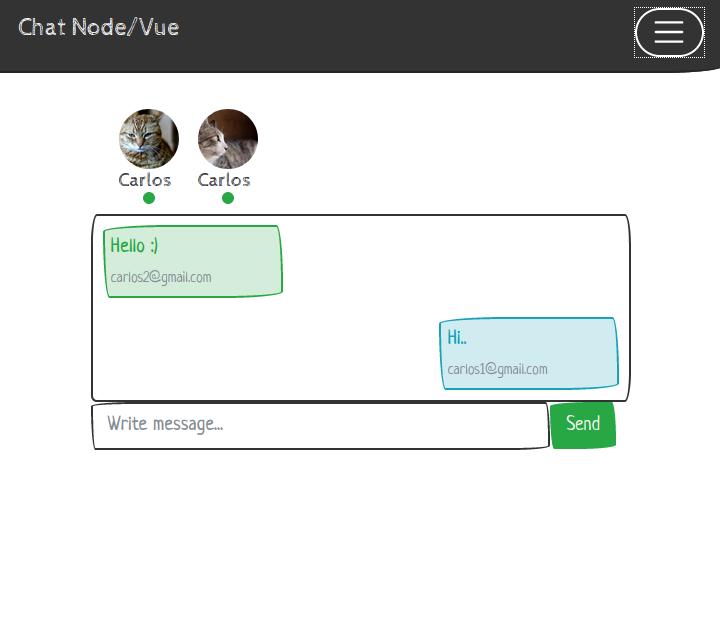

# Chat with Express

### Install

> git clone https://github.com/GiancarloAparicio/Real-Time-Node.git
>
> cd Real-Time-Node
>
> npm install && npm run serve <> http://localhost:8000/chat (Default)

### Preview

