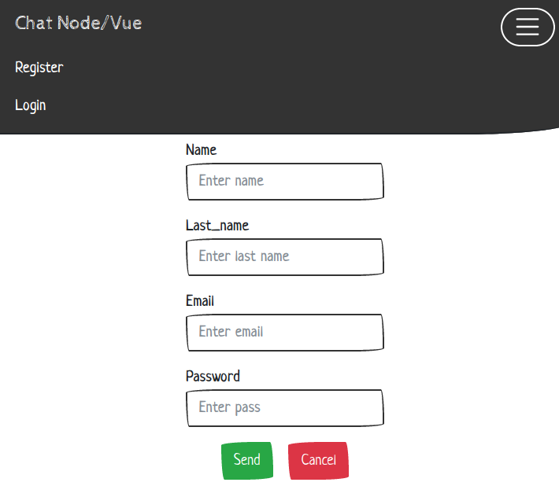
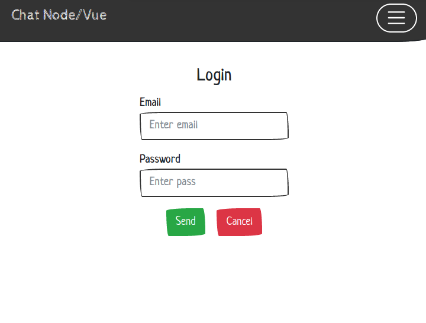
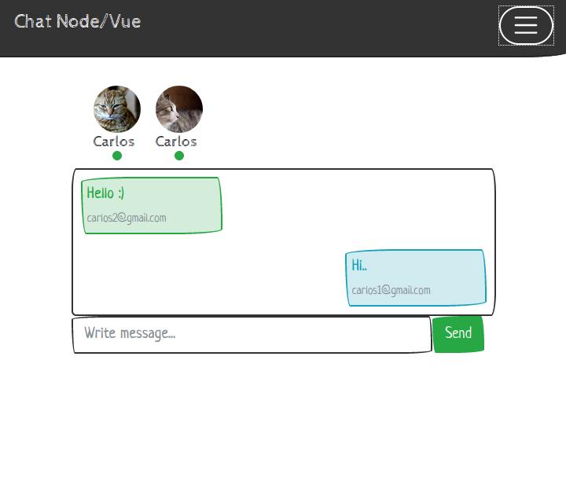

# Chat with Express

&nbsp;
&nbsp;
&nbsp;
&nbsp;

&nbsp;
&nbsp;

&nbsp;
&nbsp;
&nbsp;

&nbsp;
&nbsp;

## Requirements

* Docker 19.0.0+
* Docker-Compose 1.2.0+

## Install

Clone the repository:

    git clone git@github.com:GiancarloAparicio/Real-Time-Node.git

Create and lift the containers
    
    docker-compose up -d

Install dependencies

    docker exec -it chat-node sh

    npm install && npm run serve 
    

By default the page will be displayed in:

    http://localhost:8000/chat 

### Preview Gif

### Preview Image

### MySql

To activate MySql change the .ENV variables, the ORM TyOrm was used

By default Docker is already prepared to support MySql in the same internal network

Warning: It is not used in production, it is only a demo with basic functionalities.

### Credits

* Boilerplate: https://github.com/GiancarloAparicio/Template-Express
* Bootstrap: https://getbootstrap.com/